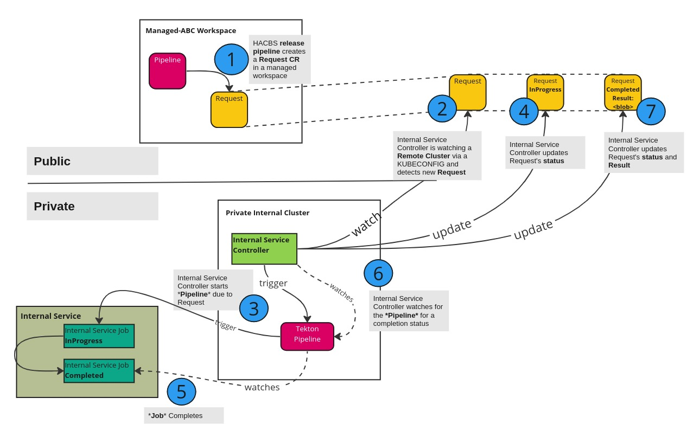

# Internal Services

## Overview

The Internal Services system consists of a kubernetes controller (running on the Internal, Private cluster) that is capable of watching and reconciling Custom Resources on a Remote Cluster.
These Custom Resources describe which pipelines and parameters to use to execute internal jobs on the Internal, Private cluster.
The results and outcome of the pipeline are added as an update to the Custom Resources. The Remote Cluster watches these resources to determine the outcome.

## Goals

* The Internal Services system attempts to enable execution of internal jobs via a polling mechanism.
* The Internal Services system provides execution results back to the requesting cluster.

## System Context

The diagram below shows the interaction of the internal services controller and other services and shows the flow of custom resources

## Terminology

**InternalRequest** - The custom resource that describes the internal service to trigger the internal job on.
**Remote Cluster** - A Red Hat Trusted Application member cluster that resides outside of Red Hat's network.
**Internal, Private Cluster** - A cluster that is not externally addressable but which has access to Red Hat's network.
**App Interface** - A repository that serves as a central coordination point for hosted services operated by the Application SRE team.

## Resources
Below is the list of CRs that the Internal Service is responsible for interacting with:

### CREATE

| Custom Resource             | When?                                                                                                             | Why?                                           |
|-----------------------------|-------------------------------------------------------------------------------------------------------------------|------------------------------------------------|
| PipelineRun                 | Once a InternalRequest has been reconciled and the Pipeline to run has been discovered and is ready for execution | To perform the steps in the Internal Pipeline  |

### READ

| Custom Resources     | When?                                                       | Why?                                                                   |
|----------------------|-------------------------------------------------------------|------------------------------------------------------------------------|
| Config               | During controller startup and during each reconcile attempt | To obtain configuration information                                    |

### UPDATE

| Custom Resource  | When?                                                              | Why?                                                                      |
|------------------|--------------------------------------------------------------------|---------------------------------------------------------------------------|
| InternalRequest  | During the lifecycle of an attempt to complete an InternalRequest  | To provide status for the execution of the Pipeline to the remote cluster |

### WATCH

| Custom Resource            | When?                                                      | Why?                                                                               |
|----------------------------|------------------------------------------------------------|------------------------------------------------------------------------------------|
| InternalRequest            | Always                                                     | To provide an API to process an internal request                                   |
| PipelineRun                | Once the PipelineRun is created                            | To relay the Internal PipelineRun status to the remote InternalRequest for viewing |

## Security Risk Mitigations

Enabling remote clusters the ability to run internal jobs carrying certain security risks. The following list describes measures in places to mitigate those risks.

* The creation of an `InternalRequest` custom resource requires permission on the Remote Cluster.
* The Internal Services controller instance is configured to watch a specific cluster.
  * This cluster is provided to the controller as an argument to a secret that was added by the admin team.
  * The secret contains a KUBECONFIG file.
* Only pipelines that are defined within the controller's namespace can be executed on the Internal, Private cluster.
  * The deployment of these pipelines is controlled by App Interface and is orchestrated via GitHub pull requests.
  * In addition, pipelines deployed to production are pinned to Git commit SHAs described in App Interface.
* The Internal Services controller only acts on remote namespaces that are specifically allowed in the `Config` custom resource.

## Detailed Workflow

1. A `InternalRequest` CR is created by a pipeline run by a service account on the remote cluster as part of a pipeline.
    * The `spec.request` should reference the pipeline to execute.
    * The `spec.params` should reference the parameters to pass to the pipeline.
2. The `InternalRequest` CR is noticed by the Internal Services controller and attempts to reconcile it.
3. The Internal Services controller verifies whether the remote namespace is allowed in the `Config` CR.
4. If it is not allowed, the Internal Services controller updates the `InternalRequest` CR `status` field accordingly and stops reconciling.
5. If it is allowed, a `PipelineRun` is created based on the `spec.request` and `spec.params` from the `InternalRequest` CR.
6. The `PipelineRun` is watched by the Internal Services controller.
7. Upon completion, the Internal Services controller updates the `status` section of the `InternalRequest` CR
8. The remote cluster calling pipeline sees the update to the `status` of the `InternalRequest` CR and continues its execution.

### References

* App Interface - https://gitlab.cee.redhat.com/service/app-interface
